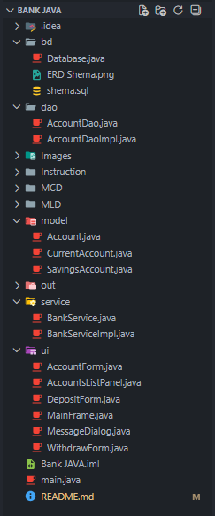

# 🏦 Bank Application – UI & Database Version

## 📌 Overview

This repository contains an **enhanced version of the Bank Application project**.

Unlike the other versions of the project, this one introduces:

* a **graphical user interface (Swing)**
* a **relational database (SQLite)**
* a cleaner, layered architecture using **DAO** and **Database** components

The main goal is to clearly separate:

* **User Interface**
* **Business Logic**
* **Data Access**

This structure is closer to what is used in real-world Java applications.

---

## 🚀 Features

* Create a bank account (Savings or Checking)
* Deposit money
* Withdraw money
* Display account details
* List all accounts
* Graphical user interface using **Swing**
* Data persistence using **SQLite**

---

## 🗂️ Project Structure

The project follows a **layered architecture**:

* **UI layer**: Swing interfaces
* **Service layer**: business logic
* **DAO layer**: database access
* **Database layer**: SQLite connection and configuration

---

## 🆕 Differences from Other Versions

Other repositories of this project:

* use **console-based (CLI)** interaction
* store data **in memory** (Map / List)
* do **not** use a database
* do **not** include a graphical interface

👉 **This version adds:**

* Swing-based GUI
* SQLite database for persistence
* DAO pattern for data access
* Clear separation of concerns
* A structure closer to a real enterprise application

---

## 🚧 Project Status

⚠️ **This project is currently under development.**

The following parts are still in progress:

* Complete database integration
* Final DAO implementations
* Full UI ↔ Service ↔ DAO wiring
* Additional validations and error handling

The overall architecture and structure are already in place,
but some features are not fully implemented yet.

---

## 🛠️ Technologies Used

* **Java**
* **Swing**
* **JDBC**
* **SQLite**

---

## 🎯 Educational Purpose

This project was built to practice and reinforce:

* Object-Oriented Programming (inheritance, polymorphism)
* Interfaces and implementations
* Layered architecture
* Java ↔ Database connectivity (JDBC)
* Separation of concerns (UI / Service / DAO)

---

## 📌 Notes

This repository is intended for **learning and demonstration purposes**.
It showcases the evolution of the same project from a simple console-based application to a more realistic, layered Java application with a graphical interface and database persistence.

